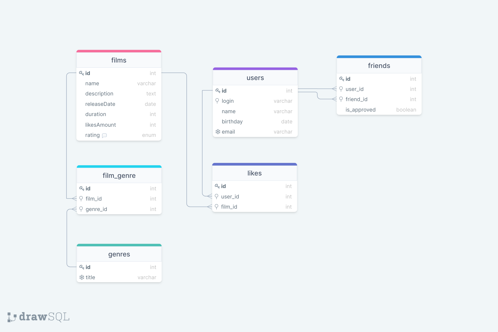

# Filmorate project
Пояснение
 - Ключик - означает первичный ключ.
 - Снежинка - unique constraint.
 - Увеличительное стекло - индекс.

Поля id в виде int, в реальных проектах используют UUID, но у нас их еще не проходили и меня пару раз с ними заворачивали.

В таблице films поле  rating упакаем в enum https://postgrespro.ru/docs/postgrespro/10/datatype-enum или сделаем varchar, а enum обеспечим средствами SpringBoot.

Таблица friends обеспечивает `many-to-many` связь пользователей друг с другом. В схеме не отражено, но добавим `unique_constraint(user_id, friend_id)`.

Таблица likes обеспечивает `many-to-many` связь пользователей с фильмами. В схеме не отражено, но добавим `unique_constraint(user_id, film_id)`.

Таблица film_genre обеспечивает `many-to-many` связь фильмов и жанров. В схеме не отражено, но добавим `unique_constraint(film_id, genre_id)`.

В таблицах не стал использовать составных индексов, т.к. они для планируемых выборок очевидно не нужны.
